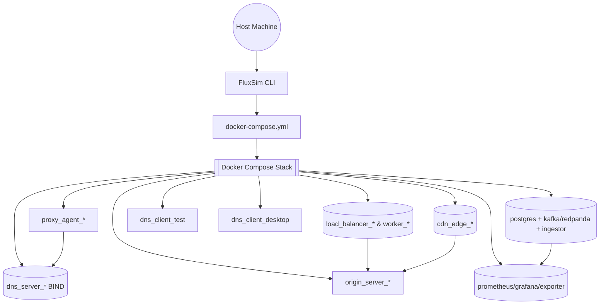
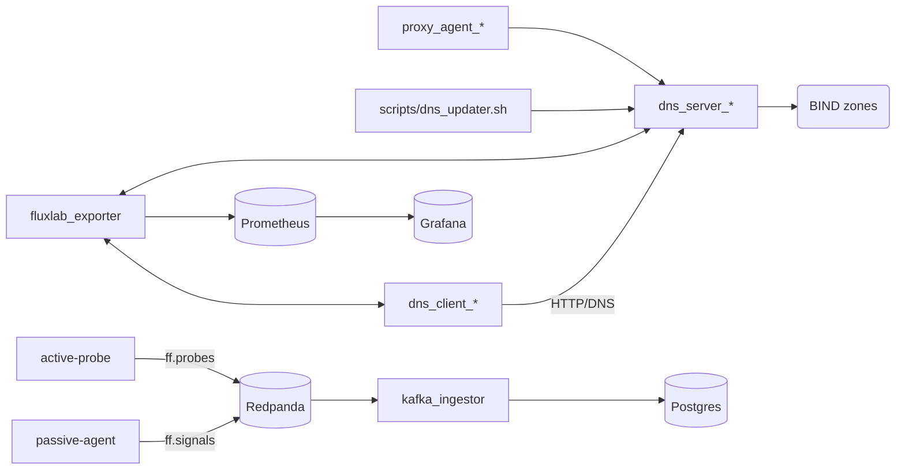

# FluxSim (Multi-Flux Simulator)

Spin up DNS fast-flux, load-balancer, and CDN-like playgrounds in Docker with a friendly CLI.
FluxSim was designed for experimentation and teaching—create networks on the fly, scale them
live, and observe how DNS, HTTP, and monitoring react.

## Table of Contents

1. [Quickstart](#quickstart)
2. [Architecture Overview](#architecture-overview)
3. [Network Topologies](#network-topologies)
4. [Runtime Services](#runtime-services)
5. [CLI Workflow](#cli-workflow)
6. [Client Access](#client-access)
7. [Data & Monitoring Pipeline](#data--monitoring-pipeline)
8. [Host DNS Access](#host-dns-access)
9. [Contributing & Tooling](#contributing--tooling)

## Quickstart

```bash
pip install -e .[dev]  # install FluxSim + dev toolchain
pre-commit install

fluxsim
# inside the REPL
add_flux_network fluxy
set_flux_n fluxy 3
set_flux_interval fluxy 5
deploy
status
desktop_start    # optional: launch GUI desktop (noVNC)
```

Copy your own configs (`Dockerfile.client`, `Dockerfile.dns`, `nginx_configs/*`,
`scripts/dns_updater.sh`, `dns_config/named.conf.*`) into this repo to customise the labs.

## Architecture Overview



## Network Topologies

| Kind   | Description | Default components |
|--------|-------------|--------------------|
| `normal` | Plain origin server with one authoritative DNS | `dns_server_*`, `origin_server_*` |
| `flux`   | Fast-flux rotation through nginx proxies | + `proxy_agent_*`, optional scaling, dynamic zone updates |
| `lb`     | Layer-7 load balancer with worker pool | + `load_balancer_*`, `worker_*` |
| `cdn`    | CDN-style multi-edge deployment | + `cdn_edge_*` (scalable), origin |

FluxSim allocates subnets automatically (beginning at `172.60.0.0/24`) so networks can coexist.

## Runtime Services



## CLI Workflow

- **Network management**: `add_*_network`, `remove_network`, `status`
- **Tuning**: `set_flux_n`, `set_worker_n`, `set_cdn_n`, `set_ttl`, `set_flux_interval`,
  `set_flux_selector`, `set_lb_algo`
- **Live ops**: `deploy`, `stop`, `flux_add_agent`, `flux_remove_agent`, `lb_add_worker`,
  `lb_remove_worker`, `cdn_add_edge`, `cdn_remove_edge`, `flux_set_ttl`
- **Client helpers**: `client_browse`, `desktop_start`, `desktop_stop`

All commands mutate a shared registry (`monitoring/registry.json`) so the exporter and dashboards
stay in sync.

## Client Access

- **Text / notebooks** (`dns_client_test`)
  - Jupyter Lab at http://localhost:8888 (no token, root dir `/workspace`)
  - `client_browse <hostname>` uses `lynx -dump` inside the container.
- **GUI desktop** (`dns_client_desktop`)
  - Opt-in via `desktop_start`, available at http://localhost:8081 (noVNC, user `abc`, password
    `abc`). Stop it with `desktop_stop` when idle.

Both clients share the generated `resolv.conf`, so queries run with the same resolver order you set
in the CLI (`dns_client_order`, `dns_client_set`).

## Data & Monitoring Pipeline

Set Postgres credentials (e.g., in `.env`) before deploying:

```
PGUSER=fluxlab
PGPASSWORD=fluxlab
PGDATABASE=fluxlab
```

- **Agents**: `active-probe` emits DNS answers/TTL observations; `passive-agent` tails bind query
  logs.
- **Transport**: Redpanda (Kafka-compatible) topics `ff.probes` and `ff.signals`.
- **Storage**: `kafka_ingestor` writes events into Postgres tables `probe_events` and
  `signal_events`.
- **Monitoring**: `fluxlab_exporter` exposes scrape metrics combining runtime health and ingested
  events. Prometheus/Grafana (default credentials `admin` / `fluxlab`) run on http://localhost:9090
  and http://localhost:3000.
- **Adminer**: browse database contents at http://localhost:8080.

## Host DNS Access

Every BIND server now publishes to the host. FluxSim assigns deterministic ports starting at 5300
(`dns_server_*` sorted alphabetically). Both TCP and UDP are mapped:

```bash
dig @127.0.0.1 -p 5300 fluxy.sim.local
dig @127.0.0.1 -p 5301 cdn1.sim.local
```

This makes it easy to test lookups from the host or external tools without entering the stack.

## Contributing & Tooling

Install development dependencies and pre-commit hooks:

```bash
pip install -e .[dev]
pre-commit install
```

Run the quality suite locally before pushing:

```bash
ruff check .
ruff format --check .
black --check .
mypy fluxsim
pytest
```

GitHub Actions repeats these steps for every push and pull request (`.github/workflows/ci.yml`).

## License

FluxSim is released under the MIT License. See [`LICENSE`](LICENSE) for details.
